# Data_reprocessing

1. [NLP](#nlp)
2. [Computer Vision](#computer-vision)

 I have created this repository that covers approximately 98% of the preprocessing steps for any data, including a brief explanation of each step and example code to demonstrate how it is done.

I would like to emphasize two important points:

- I welcome any feedback or suggestions because my main goal is to assist and help.
- Some of the techniques included in the repository may not be necessary for certain tasks. For example, in the case of sentiment analysis, it may not be suitable to apply stop word removal because it can remove important negations like "not" which carry significant meaning. It is crucial to understand the data and its characteristics before applying any preprocessing techniques.

This README provides an overview of common data preprocessing steps using Python. Each step is accompanied by an example code snippet.

## NLP
## Steps

1. **Data Collection**:
    Data collection is the systematic process of gathering, organizing, and analyzing information to gain insights and make informed decisions.
   - Using pandas to read data from CSV files:
     ```python
     import pandas as pd
     data = pd.read_csv('data.csv')
     ```

2. **Data Cleaning**:
    Data cleaning refers to the process of identifying and correcting or removing errors, inconsistencies, and inaccuracies from a dataset to ensure its quality and reliability for analysis and decision-making purposes.
   - Handling missing values using pandas:
     ```python
     data.dropna()  # Remove instances with missing values
     data.fillna(value)  # Impute missing values with a specific value
     ```

3. **Data Integration**:
     Data integration is the process of combining and merging data from multiple sources or systems into a unified and cohesive format, enabling comprehensive analysis and a holistic view of the information.
   - Merging datasets using pandas:
     ```python
     merged_data = pd.concat([data1, data2], axis=1)  # Concatenate horizontally
     merged_data = pd.merge(data1, data2, on='key_column')  # Merge based on a common column
     ```

4. **Data Transformation**:
    Data transformation refers to the process of converting or altering data from its original format or structure into a standardized or desired format, allowing for improved compatibility, analysis, and usability.
   - Normalizing data using scikit-learn:
     ```python
     from sklearn.preprocessing import MinMaxScaler
     scaler = MinMaxScaler()
     normalized_data = scaler.fit_transform(data)
     ```

5. **Feature Selection/Extraction**:
     Feature selection/extraction is the process of identifying and selecting the most relevant and informative features from a dataset, or creating new features, in order to improve the performance and efficiency of machine learning models and reduce dimensionality.
   - Selecting top-K features based on feature importance using scikit-learn:
     ```python
     from sklearn.feature_selection import SelectKBest, f_regression
     selector = SelectKBest(score_func=f_regression, k=5)
     selected_features = selector.fit_transform(data, target)
     ```

6. **Handling Categorical Data**:
    Handling categorical data involves converting categorical variables into a numerical representation, such as one-hot encoding or label encoding, to enable their effective utilization in machine learning algorithms and statistical analyses.
   - One-hot encoding categorical variables using pandas:
     ```python
     encoded_data = pd.get_dummies(data, columns=['categorical_column'])
     ```

7. **Handling Text Data**:
    Handling text data involves preprocessing and transforming textual information into a numerical representation, commonly through techniques such as tokenization, stemming or lemmatization, removing stop words, and applying methods like TF-IDF or word embeddings, to facilitate natural language processing tasks like text classification, sentiment analysis, or information retrieval.
   - Text preprocessing using NLTK library:
     ```python
     import nltk
     from nltk.corpus import stopwords
     from nltk.tokenize import word_tokenize
     nltk.download('stopwords')
     nltk.download('punkt')

     stop_words = set(stopwords.words('english'))
     preprocessed_text = []

     for text in data['text_column']:
         tokens = word_tokenize(text)
         filtered_tokens = [token.lower() for token in tokens if token.lower() not in stop_words]
         preprocessed_text.append(filtered_tokens)
     ```

8. **Dimensionality Reduction**:
     Dimensionality reduction is a technique used to reduce the number of features or variables in a dataset while retaining the most relevant information, typically through methods like principal component analysis (PCA) or t-distributed stochastic neighbor embedding (t-SNE), which can help alleviate the curse of dimensionality and improve computational efficiency in data analysis and machine learning tasks.
   - Applying Principal Component Analysis (PCA) using scikit-learn:
     ```python
     from sklearn.decomposition import PCA
     pca = PCA(n_components=2)
     reduced_data = pca.fit_transform(data)
     ```

9. **Splitting the Dataset**:
     Splitting the dataset refers to dividing the available data into separate subsets, typically into training, validation, and testing sets, to evaluate and validate the performance of a machine learning model, ensuring generalizability and avoiding overfitting by using distinct data for training, evaluation, and final testing.
   - Dividing the preprocessed dataset into training, validation, and testing sets:
     ```python
     from sklearn.model_selection import train_test_split
     X_train, X_val, y_train, y_val = train_test_split(features, target, test_size=0.2, random_state=42)
     ```

10. **Data Sampling**:
      Data sampling is the process of selecting a subset of data points from a larger dataset in order to gain insights, make inferences, or build models on a representative portion of the data, often using techniques such as random sampling, stratified sampling, or oversampling/undersampling to address class imbalance or specific sampling requirements.
    - Selecting a subset of the data using random sampling:
      ```python
      sampled_data = data.sample(n=100, random_state=42)
      ```

11. **Data Visualization**:
      Data visualization is the graphical representation of data using charts, graphs, or other visual elements to effectively communicate patterns, trends, and relationships within the data, making it easier for humans to understand and interpret complex information.
    - Plotting data using matplotlib:
      ```python
      import matplotlib.pyplot as plt
      plt.scatter(data['x'], data['y'])
      plt.xlabel('X')
      plt.ylabel('Y')
      plt.show()
      ```

12. **Data Auditing**:
    Data auditing involves the systematic examination and evaluation of data to ensure its accuracy, completeness, consistency, and adherence to predefined standards or rules, often performed through data profiling, validation checks, and data quality assessments to identify and address any data anomalies or issues.
    - Checking data accuracy and completeness:
      ```python
      data.describe()  # Summary statistics
      data.isnull().

13. **Data Documentation**:
     Data documentation refers to the process of creating comprehensive and detailed documentation that describes various aspects of a dataset, including its structure, variables, meanings, data sources, data collection methods, data transformations, and any other relevant information, to facilitate understanding, reproducibility, and proper usage of the data by others.
   - Create documentation that describes the data, including its sources, format, and limitations:
     ```markdown
     ## Dataset Description

     - **Source:** [Provide the source of the dataset]
     - **Format:** [Describe the format of the dataset]
     - **Limitations:** [Highlight any limitations or known issues with the dataset]

     [Provide additional information or instructions for other researchers using the data]
     ```

14. **Outlier Detection and Handling**:
     Outlier detection is the process of identifying data points that significantly deviate from the normal patterns or behavior of a dataset. Outliers can be detected using statistical methods, such as the z-score or the interquartile range, or using machine learning algorithms designed for anomaly detection. Once outliers are detected, they can be handled by either removing them from the dataset, replacing them with more representative values, or treating them separately in the analysis, depending on the specific context and goals of the data analysis.
    - Univariate Outlier Detection using Z-Score:
The first stage involves detecting outliers in each variable individually, without considering the relationships between variables. The z-score is a widely used statistical method for this purpose. It measures how many standard deviations a data point deviates from the mean of the variable. A commonly used threshold is a z-score of 3, which considers any data point beyond three standard deviations as an outlier.
  
   - Identify and handle outliers in the data:
     ```python
     from scipy import stats
     z_scores = stats.zscore(data)
     outliers = (np.abs(z_scores) > 3).any(axis=1)
     cleaned_data = data[~outliers]
     ```
  - Multivariate Outlier Detection using PCA (Principal Component Analysis):
The second stage involves considering the relationships between variables and identifying outliers based on their collective behavior. PCA is a dimensionality reduction technique that can also be used for outlier detection. By transforming the data into a new set of uncorrelated variables (principal components), PCA can help identify outliers that deviate significantly from the overall patterns observed in the dataset. The outliers detected at this stage may capture more complex interactions and dependencies between variables.
       ```python
       import numpy as np
from sklearn.decomposition import PCA

# Assume 'data' is your cleaned_data from the previous stage (univariate outlier removal)

# Perform PCA
pca = PCA()
pca.fit(data)

# Calculate the Mahalanobis distance
mahalanobis_dist = pca.transform(data)

# Set a threshold for outlier detection (e.g., 3 standard deviations)
threshold = 3 * np.std(mahalanobis_dist)

# Identify outliers based on the Mahalanobis distance exceeding the threshold
outliers = np.where(np.abs(mahalanobis_dist) > threshold)

# Print the indices of the outlier data points
print("Indices of outliers:", outliers) 
     ```
15. **Imbalanced Data Handling**:
      
Imbalanced data handling refers to addressing the issue of imbalanced class distribution in a dataset, where one class has significantly more or fewer instances than the others. Techniques for handling imbalanced data include resampling methods such as oversampling (increasing the minority class samples) or undersampling (reducing the majority class samples), using different performance metrics like F1-score or area under the receiver operating characteristic curve (AUC-ROC) to evaluate model performance, applying algorithmic approaches like cost-sensitive learning or ensemble methods, or utilizing synthetic data generation techniques such as SMOTE (Synthetic Minority Over-sampling Technique) to balance the class distribution and improve the performance of machine learning models
   - Address class imbalance issues in the dataset:
     ```python
     from imblearn.over_sampling import SMOTE
     smote = SMOTE(random_state=42)
     balanced_data, balanced_labels = smote.fit_resample(data, labels)
     ```

16. **Feature Scaling**:
     Feature scaling is the process of transforming numerical features in a dataset to a common scale or range to ensure that they have comparable magnitudes and do not disproportionately influence the learning algorithm. Common techniques for feature scaling include standardization (subtracting the mean and dividing by the standard deviation) or normalization (scaling values to a specific range, such as 0 to 1), which help improve the convergence and performance of machine learning models, particularly those based on distance or gradient-based optimization algorithms.
   - Scale numerical features to a similar range or distribution:
     ```python
     from sklearn.preprocessing import MinMaxScaler
     scaler = MinMaxScaler()
     scaled_data = scaler.fit_transform(data)
     ```

17. **Handling Time-Series Data**:
Handling time-series data involves analyzing and modeling data points that are collected at successive time intervals. Some common techniques for handling time-series data include:

Time-series decomposition: Separating the data into its trend, seasonality, and residual components to better understand and model the underlying patterns.
- Smoothing techniques: Applying moving averages or exponential smoothing methods to reduce noise and identify long-term trends.
- Feature engineering: Creating additional features such as lagged variables or rolling statistics to capture temporal dependencies and improve predictive modeling.
- Time-series forecasting: Utilizing techniques like autoregressive integrated moving average (ARIMA), seasonal ARIMA (SARIMA), or machine learning algorithms such as recurrent neural networks (RNNs) or - - long short-term memory (LSTM) networks for predicting future values based on historical patterns.
- Handling irregular time intervals: If the time-series data has irregular intervals, interpolation or resampling methods can be employed to align the data to a regular time grid.
- Visualization: Plotting time-series data using line charts, scatter plots, or heatmaps to identify trends, seasonality, anomalies, and relationships between variables.
- Time-series evaluation: Assessing the performance of time-series models using metrics like mean absolute error (MAE), root mean squared error (RMSE), or forecasting accuracy measures like mean absolute percentage error (MAPE).
   - Preprocess time-series data by handling irregularities, missing values, and aligning time steps:
     ```python
     import pandas as pd
     df = pd.read_csv('time_series_data.csv', parse_dates=['timestamp'])
     df = df.set_index('timestamp')
     df = df.resample('D').mean()
     ```

18. **Handling Noisy Data**:
     Handling noisy data involves addressing the presence of unwanted or irrelevant variations, errors, or outliers in a dataset. Here are some approaches for handling noisy data:

- Data cleansing: Applying techniques like outlier detection and removal, error correction, or imputation to mitigate the impact of noise on the dataset.
- Smoothing techniques: Employing filters or averaging methods such as moving averages, median filters, or low-pass filters to reduce random fluctuations and smooth out noisy signals.
- Robust statistics: Utilizing statistical methods that are less sensitive to outliers, such as robust estimators (e.g., median instead of mean) or robust regression techniques like RANSAC (Random Sample Consensus).
- Feature selection: Identifying and selecting the most informative and robust features that are less affected by noise to improve the performance of machine learning models.
- Ensemble methods: Utilizing ensemble techniques like bagging or boosting that combine multiple models to reduce the impact of noise and enhance overall performance.
- Data augmentation: Generating additional synthetic data points based on existing data by applying transformations, perturbations, or adding noise within reasonable bounds to increase the robustness of the model.
- Model-based approaches: Employing specific models designed to handle noisy data, such as robust regression models, noise-tolerant clustering algorithms, or outlier detection algorithms.
- Domain knowledge: Leveraging expert knowledge or domain-specific insights to identify and handle noise appropriately, such as using known constraints or physical limitations to filter out unrealistic data points.
   - Identify and handle noisy data in the dataset:
     ```python
     from scipy.signal import medfilt
     filtered_data = medfilt(data, kernel_size=3)
     ```

19. **Handling Skewed Data**:
    
Handling skewed data involves addressing the issue of imbalanced distribution or skewness in the target variable or predictor variables. Here are some approaches for handling skewed data:

- Logarithmic transformation: Applying logarithmic transformation (e.g., taking the logarithm of the values) to reduce the impact of extreme values and compress the range of skewed variables.
- Power transformation: Using power transformations like Box-Cox or Yeo-Johnson to achieve a more symmetric distribution and reduce skewness.
- Winsorization: Replacing extreme values with less extreme values, often by capping or truncating the outliers to a certain percentile of the distribution.
- Binning or discretization: Grouping continuous variables into bins or discrete categories to reduce the impact of extreme values and create more balanced distributions.
- Data augmentation: Generating synthetic data points, particularly for the minority or skewed class, through techniques like oversampling or SMOTE to balance the class distribution and provide more representative samples.
- Weighted sampling or cost-sensitive learning: Assigning higher weights to underrepresented or minority class samples during model training to give them more importance and address the imbalance issue.
- Ensemble methods: Employing ensemble techniques like bagging or boosting that can handle imbalanced data by combining multiple models or adjusting class weights to improve classification performance.
- Resampling techniques: Using undersampling (reducing the majority class samples) or oversampling (increasing the minority class samples) methods to balance the class distribution and mitigate the impact of skewness.
- Algorithm selection: Choosing algorithms that are inherently robust to class imbalance or skewed data, such as decision trees, random forests, or support vector machines with appropriate class weights or sampling techniques.
   - Address skewed data distributions:
     ```python
     import numpy as np
     log_transformed_data = np.log(data)
     ```

20. **Handling Duplicate Data**:
     Handling duplicate data involves identifying and managing instances in a dataset that are identical or nearly identical to one another. Here are some approaches for handling duplicate data:

- Identifying duplicates: Conducting a thorough analysis to identify duplicate records based on key attributes or a combination of attributes that define uniqueness in the dataset.
- Removing exact duplicates: Removing instances that are exact duplicates, where all attributes have identical values, to ensure data integrity and avoid redundancy.
- Fuzzy matching: Using fuzzy matching algorithms or similarity measures to identify approximate duplicates that may have slight variations or inconsistencies in the attribute values.
- Deduplication based on business rules: Applying domain-specific business rules or logical conditions to identify and remove duplicates that meet certain criteria or conditions.
- Key attribute selection: Choosing a subset of key attributes that uniquely define each instance and comparing records based on those attributes to identify duplicates.
- Record merging: If duplicates are identified, merging or consolidating the duplicate records into a single representative record by combining or aggregating the relevant information.
- Duplicate tracking: Maintaining a separate identifier or flag to track and manage duplicates, allowing for traceability and auditability of the data cleaning process.
- Prevention strategies: Implementing data validation rules, unique constraints, or duplicate prevention mechanisms at the data entry stage to minimize the occurrence of duplicate data.
   - Identify and remove duplicate instances from the dataset:
     ```python
     deduplicated_data = data.drop_duplicates()
     ```

21. **Feature Engineering**:
     Feature engineering is the process of creating new, informative, and representative features from existing data to enhance the performance and predictive power of machine learning models.
   - Create new features from existing ones or domain knowledge:
     ```python
     data['new_feature'] = data['feature1'] + data['feature2']
     ```

22. **Handling Missing Data**:
      Handling missing data involves strategies and techniques to address the presence of missing values in a dataset. Common approaches for handling missing data include deletion of missing values, imputation (filling in missing values with estimated or imputed values), or using advanced techniques such as multiple imputation or modeling-based imputation to retain the integrity and completeness of the dataset during analysis or modeling tasks.
    - Handle missing values by imputing them:
      ```python
      from sklearn.impute import SimpleImputer
      imputer = SimpleImputer(strategy='mean')
      imputed_data = imputer.fit_transform(data)
      ```

23. **Data Normalization**:
      Data normalization, also known as data standardization, is the process of rescaling or transforming numerical data to a common scale or range, typically between 0 and 1 or with a mean of 0 and a standard deviation of 1, to ensure that different variables have comparable magnitudes and distributions. It helps to prevent certain variables from dominating the analysis or modeling process due to their larger scales and facilitates better interpretation, convergence, and performance of machine learning algorithms.
    - Normalize the data to a standard scale or range:
      ```python
      from sklearn.preprocessing import StandardScaler
      scaler = StandardScaler()
      normalized_data = scaler.fit_transform(data)
      ```

24. **Addressing Data Privacy and Security**:
      Addressing data privacy and security involves implementing measures to protect sensitive data from unauthorized access, ensuring compliance with privacy regulations, and safeguarding against potential threats or breaches.
    - Implement techniques to protect sensitive information and ensure data privacy and security:
      - Encrypt sensitive data
      - Apply access controls and permissions
      - Anonymize or de-identify personal information


25. **Handling Multicollinearity**:
   Handling multicollinearity refers to addressing the issue of high correlation or interdependency between predictor variables in a regression or modeling context by applying techniques such as feature selection, variable transformation, or using advanced methods like principal component analysis (PCA) or ridge regression to mitigate the negative impact of multicollinearity on the model's interpretability and stability.
   - Identify and handle multicollinearity among predictor variables:
     ```python
     from statsmodels.stats.outliers_influence import variance_inflation_factor
     vif = pd.DataFrame()
     vif["Feature"] = X.columns
     vif["VIF"] = [variance_inflation_factor(X.values, i) for i in range(X.shape[1])]
     ```

26. **Handling Seasonality and Trend**:
    Handling seasonality and trend involves identifying and modeling the repetitive patterns and long-term directional movements in time series data to understand their impact and make accurate predictions or forecasts.
   - Handle seasonality and trend components in time-series data:
     ```python
     from statsmodels.tsa.seasonal import seasonal_decompose
     decomposition = seasonal_decompose(data, model='additive', period=12)
     ```

27. **Handling Skewed Target Variables**:
     
Handling skewed target variables involves addressing the issue of imbalanced or skewed distributions in the outcome variable of a predictive modeling task. Common approaches for handling skewed target variables include log-transformations, using appropriate evaluation metrics (e.g., mean absolute error or area under the receiver operating characteristic curve) to assess model performance, applying algorithms designed for imbalanced data (e.g., cost-sensitive learning or ensemble methods), or employing resampling techniques like oversampling or undersampling to balance the class distribution and improve the performance of machine learning models.
   - Apply transformations to make the target variable more symmetric:
     ```python
     import numpy as np
     transformed_target = np.log1p(target)
     ```

28. **Data Partitioning for Cross-Validation**:
     Data partitioning for cross-validation involves splitting a dataset into training and validation subsets, allowing for iterative model training and evaluation to assess its generalization performance and mitigate overfitting.
   - Divide the dataset into multiple folds for cross-validation:
     ```python
     from sklearn.model_selection import KFold
     kf = KFold(n_splits=5, shuffle=True, random_state=42)
     for train_index, val_index in kf.split(X):
         X_train, X_val = X[train_index], X[val_index]
         y_train, y_val = y[train_index], y[val_index]
     ```

29. **Handling Sparse Data**:
      Handling sparse data involves managing datasets where the majority of values are zeros or missing, often through techniques such as feature selection, data imputation, or sparse matrix representations, to effectively utilize and analyze the available information.
   - Handle sparse datasets using techniques like sparse matrix representation or dimensionality reduction:
     ```python
     from scipy.sparse import csr_matrix
     sparse_matrix = csr_matrix(data)
     ```

30. **Handling Time Delays**:
    Handling time delays refers to addressing the temporal relationship between variables in a time series or sequential data analysis, taking into account the lagged effects or dependencies over different time periods by incorporating lagged variables, time shifting, or using time series forecasting models to capture and account for the time delay in the data.
   - Account for time delays or lags in time-series analysis:
     ```python
     import pandas as pd
     df['lag_1'] = df['target'].shift(1)
     ```

31. **Handling Non-Numeric Data**:
     
Handling non-numeric data involves converting or transforming categorical or qualitative data into a numerical representation that can be processed by machine learning algorithms, typically through techniques such as one-hot encoding, label encoding, or embedding methods.
   - Preprocess non-numeric data such as categorical variables or text data:
     ```python
     from sklearn.preprocessing import OneHotEncoder
     encoder = OneHotEncoder()
     encoded_data = encoder.fit_transform(data)
     ```

32. **Handling Incomplete Data**:
     Handling incomplete data involves addressing the issue of missing or partially available values in a dataset by applying techniques such as data imputation, deletion of missing values, or using advanced methods like multiple imputation or modeling-based imputation to handle missing data and retain the integrity and usefulness of the dataset for analysis or modeling tasks.
   - Handle incomplete or missing records in the dataset:
     ```python
     from sklearn.impute import SimpleImputer
     imputer = SimpleImputer(strategy='mean')
     imputed_data = imputer.fit_transform(data)
     ```

33. **Handling Long-Tailed Distributions**:
    Handling long-tailed distributions involves addressing the presence of imbalanced or heavily skewed data distributions, typically characterized by a large number of infrequent occurrences or outliers, by applying techniques such as resampling methods (e.g., oversampling or undersampling), data augmentation, using appropriate evaluation metrics (e.g., precision-recall curve), or applying specialized algorithms designed to handle imbalanced data to improve the model's performance and mitigate the impact of the long tail.
   - Normalize distributions with long tails using techniques like log-transformations or power-law transformations:
     ```python
     transformed_data = np.log1p(data)
     ```

34. **Data Discretization**:
    
    Data discretization, also known as binning, is the process of transforming continuous or numerical data into discrete intervals or categories. This can be achieved through various techniques such as equal-width binning (dividing the data into bins of equal width), equal-frequency binning (dividing the data into bins with an equal number of data points), or more advanced methods like clustering-based binning or decision tree-based discretization. Discretization can help simplify data analysis, reduce the impact of outliers, and enable the use of algorithms that require categorical or ordinal data.
      - Convert continuous variables into categorical or ordinal variables through data discretization:

          ```python
          from sklearn.preprocessing import KBinsDiscretizer
          discretizer = KBinsDiscretizer(n_bins=5, encode='ordinal', strategy='quantile')
          discretized_data = discretizer.fit_transform(data)
          ```

35. **Handling Data Dependencies**:
      Handling data dependencies involves addressing the relationships or dependencies between variables in a dataset to ensure accurate modeling and analysis. This can be done through various techniques, such as feature engineering to create new derived features that capture the dependencies, applying dimensionality reduction techniques to eliminate redundant or highly correlated variables, using specialized models or algorithms that explicitly handle dependencies (e.g., Bayesian networks or Markov models), or incorporating time series analysis methods to capture temporal dependencies in sequential data. Effective handling of data dependencies helps to improve the interpretability, predictive accuracy, and generalizability of the models.
    - Consider and handle dependencies or relationships between different observations or instances in the dataset:
      ```python
      # Example for time-series analysis
      df['lag_1'] = df['target'].shift(1)
      df['lag_2'] = df['target'].shift(2)
      ```

# Computer-Vision

## steps

in this section we will learn about the steps of image processing
the main need of image processing is to make the image more clear and easy to understand for the machine

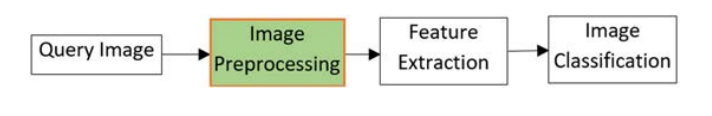

mainly image processing is divided into 2 types:
**Spatial domain :** in this type we will work on the image itself means we will change the pixels of the image using kernels 
and
 **Frequency domain :** in this type we will work on the frequency of the image using fourier transform then we will change the frequency of the image then we will use inverse fourier transform to get the image back

1. **Read The Image**:
  Read the image means to load the image into the memory of the computer so we can process it
  - Read an image from a file using OpenCV:
    ```python
     import cv2
     image = cv2.imread('image.jpg')
     ```
  - Read an image from a file using PIL:
    ```python
    from PIL import Image
    image = Image.open('image.jpg')
    ```
  - use matplotlib to show the image:
    ```python
    import matplotlib.pyplot as plt
    image = plt.imread('image.jpg') # also you can use 
    plt.imshow(image)
    plt.show()
    ```
  - when you read image using opencv it will be in BGR format so you need to convert it to RGB format:
    ```python
    image = cv2.cvtColor(image, cv2.COLOR_BGR2RGB)
    ```
    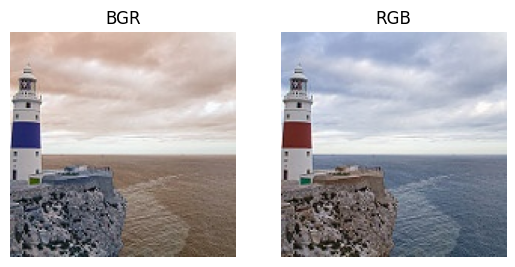

2. **Resize The Image**:
    Resize the image means to change the size of the image to make it smaller or bigger or to change the aspect ratio of the image
  - Resize an image to a specific width and height:
    ```python
    image = cv2.resize(image, (width, height))
    ```
  - Resize an image to a specific width and height while maintaining the aspect ratio:
    ```python
    image = cv2.resize(image, (width, height), interpolation=cv2.INTER_AREA)
    ```
  - Resize an image to a specific width and height while maintaining the aspect ratio and ensuring the image fits within the specified dimensions:
    ```python
    image = cv2.resize(image, (width, height), interpolation=cv2.INTER_AREA)
    ```
  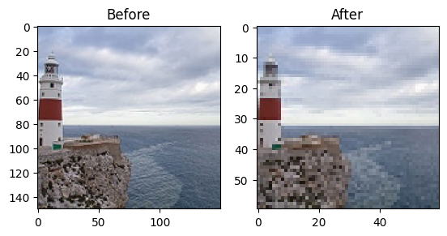

3. **Grayscale Conversion**:
    Grayscale conversion refers to converting an image from color to grayscale, which is a single-channel image containing only shades of gray. This can be done by applying a grayscale conversion formula or by using a built-in function in a library like OpenCV.
  - Convert an image from color to grayscale using a formula:
    ```python
    image = 0.299 * image[:, :, 0] + 0.587 * image[:, :, 1] + 0.114 * image[:, :, 2]
    ```
    - the formula is based wave length of the color
    means that the red color has multiple of 0.299 and the green color has multiple of 0.587 and the blue color has multiple of 0.114 , **Image is a matrix of pixels with shape (height, width, channels)**
  - Convert an image from color to grayscale using OpenCV:
    ```python
    image = cv2.cvtColor(image, cv2.COLOR_BGR2GRAY)
    ```
  - Convert an image from color to grayscale using PIL:
    ```python
    image = image.convert('L')
    ```
  

  4. **Binary Thresholding**:
    Binary thresholding refers to converting an image from grayscale to binary by applying a threshold value to each pixel in the image. This can be done by applying a thresholding formula or by using a built-in function in a library like OpenCV.
  - Convert an image from grayscale to binary using a formula:
    ```python
    image = (image > threshold).astype('uint8') * 255
    ```
  - Convert an image from grayscale to binary using OpenCV:
    ```python
    _, image = cv2.threshold(image, threshold, 255, cv2.THRESH_BINARY)
    ```
  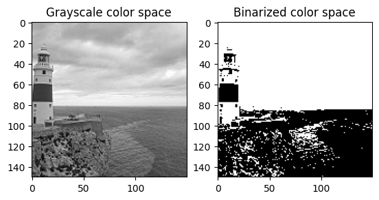

  5. **Smoothing**:
    Smoothing refers to reducing the noise in an image there are many ways to do that like using gaussian blur or median blur or bilateral filter
    for example : 
    we will use **median blur** which is a non-linear filter that replaces each pixel in the image with the median value of its neighboring pixels. This can be done by applying a median blur formula or by using a built-in function in a library like OpenCV.

  - Smooth an image using a formula:
    ```python
    image = np.median(image, (kernel_size, kernel_size))
    ```
  - Smooth an image using OpenCV:
    ```python
    image = cv2.medianBlur(image, kernel_size) # kernel_size must be odd number ex: 3, 5, 7, 9, ...
    
    image = cv2.GaussianBlur(image,5) # for example
    ```
  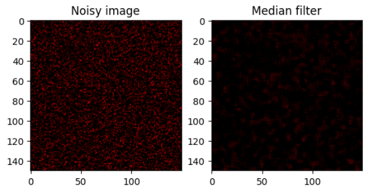
  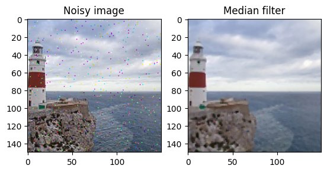

  6. **Edge Detection**:
    Edge detection refers to detecting the edges in an image. we can do that using sobel filter or laplacian filter or canny edge detection
    for example :
    we will use **canny edge detection** which is an edge detection algorithm that uses a multi-stage algorithm to detect a wide range of edges in images. This can be done by applying a canny edge detection formula or by using a built-in function in a library like OpenCV.

  - Detect edges in an image using a formula:
    ```python
    image = cv2.Canny(image, threshold1, threshold2)
    ```
  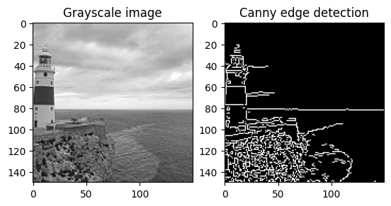

  7. **Image Segmentation**:
    Image segmentation refers to dividing an image into multiple segments. This can be done by applying a segmentation techniques
    for example :
    we will use **K-means clustering** which is a clustering algorithm that divides the pixels of an image into clusters. 
    
  - Segment an image using a formula:
    ```python
    # reshape the image to a 2D array of pixels and 3 color values (RGB)
    image = image.reshape((-1, 3))
    # convert to np.float32
    image = np.float32(image)
    # define criteria, number of clusters(K) and apply kmeans()
    criteria = (cv2.TERM_CRITERIA_EPS + cv2.TERM_CRITERIA_MAX_ITER, 10, 1.0)
    _, labels, centers = cv2.kmeans(image, K, None, criteria, 10, cv2.KMEANS_RANDOM_CENTERS)
    # convert back to 8 bit values
    centers = np.uint8(centers)
    # flatten the labels array
    labels = labels.flatten()
    # convert all pixels to the color of the centroids
    segmented_image = centers[labels.flatten()]
    # reshape back to the original image dimension
    segmented_image = segmented_image.reshape(image.shape)
    ```
    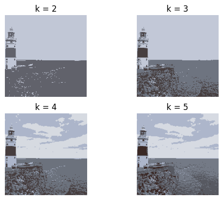

    **I used this code to segment**
    ```python
    # image segmentation using k-means clustering with loop to find the best k
    # read the image using opencv
    img = cv2.imread('/kaggle/input/intel-image-classification/seg_test/seg_test/sea/20077.jpg')
    img = cv2.cvtColor(img, cv2.COLOR_BGR2RGB)

    for k in range(2, 6):
        # reshape the image to a 2D array of pixels and 3 color values (RGB)
        pixel_vals = img.reshape((-1, 3))
        # convert to float type
        pixel_vals = np.float32(pixel_vals)

        # define stopping criteria
        criteria = (cv2.TERM_CRITERIA_EPS + cv2.TERM_CRITERIA_MAX_ITER, 100, 0.85)

        # perform k-means clustering
        ret, label, center = cv2.kmeans(pixel_vals, k, None, criteria, 10, cv2.KMEANS_RANDOM_CENTERS)

        # convert data into 8-bit values
        center = np.uint8(center)
        res = center[label.flatten()]
        res2 = res.reshape((img.shape))

        # plot the image the two images
        plt.subplot(2, 2, k-1)
        plt.axis('off')
        plt.imshow(res2)
        plt.title('k = {}'.format(k))
    plt.show()
    ```
    you can see the difference between the images with different

  8. **Image rotation**:
    Image rotation refers to rotating an image by a certain angle.

  - Rotate an image using a formula:
    ```python
    # calculate the center of the image
    center = (image.shape[1] / 2, image.shape[0] / 2)
    # rotate the image by 90 degrees
    M = cv2.getRotationMatrix2D(center, 90, 1.0)
    # 90 is the angle of rotation
    # 1.0 is the scale of rotation
    rotated_image = cv2.warpAffine(image, M, (image.shape[1], image.shape[0]))
    ```
    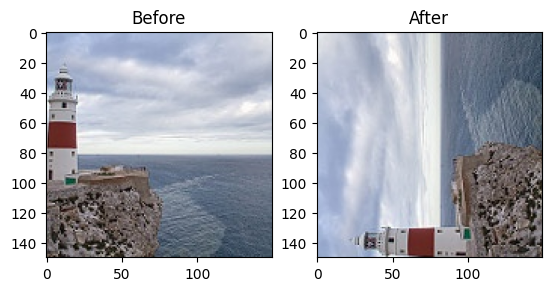
    **OR**
    ```python
    # rotate the image by 90 degrees
    rotated_image = cv2.rotate(image, cv2.ROTATE_90_CLOCKWISE)
    # cv2.ROTATE_90_CLOCKWISE is the angle of rotation
    # can be cv2.ROTATE_90_COUNTERCLOCKWISE or cv2.ROTATE_180 check the documentation
    ```
    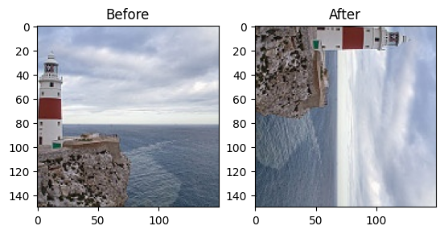

  9. **Image flipping**:
    Image flipping refers to flipping an image horizontally or vertically.

  - Flip an image using a formula:
    ```python
    # flip the image horizontally
    flipped_image = cv2.flip(image, 1)
    # 1 is the code for flipping the image horizontally
    # 0 is the code for flipping the image vertically
    # -1 is the code for flipping the image both horizontally and vertically
    ```
    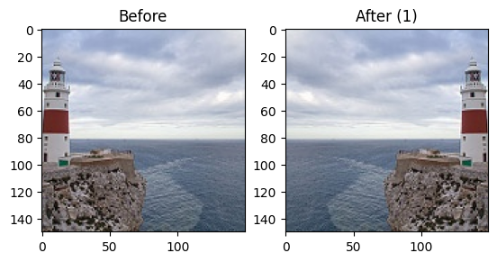
    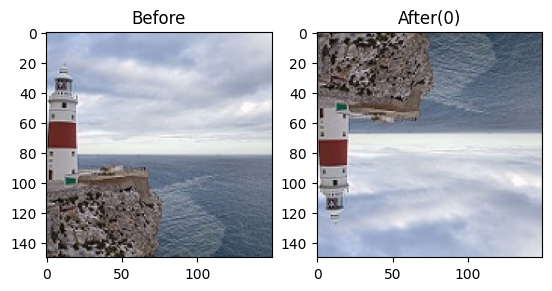
    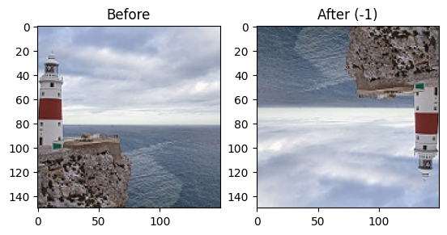

  10. **Image translation**:
    Image translation refers to shifting an image by a certain distance.

  - Translate an image using a formula:
    ```python
    # translate the image by (25, 50) pixels
    # 25 is the number of pixels to shift along the x-axis
    # 50 is the number of pixels to shift along the y-axis
    M = np.float32([[1, 0, 25], [0, 1, 50]]) # is the translation matrix used for shifting the image
    translated_image = cv2.warpAffine(image, M, (image.shape[1], image.shape[0]))
    # (image.shape[1], image.shape[0]) is the size of the output image
    ```
    

  11. **Saving an image**:
    Saving an image refers to saving an image to a file.

  - Save an image using a opencv function:
    ```python
    # save the image
    cv2.imwrite('image.jpg', image)
    # 'image.jpg' is the name of the file
    # image is the image that we want to save
    ```
    **OR using matplotlib**
    ```python
    # save the image
    plt.imsave('image.jpg', image)
    # 'image.jpg' is the name of the file
    # image is the image that we want to save
    ```
    **OR using PIL**
    ```python
    # save the image
    image.save('image.jpg')
    # 'image.jpg' is the name of the file
    # image is the image that we want to save
    ```

    13. **Addtional tips**:
      - **Read a folder of images**:
        ```python
        # read a folder of images
        import os
        for filename in os.listdir('folder_name'):
            image = cv2.imread(os.path.join('folder_name', filename))
            # do something with the image
        ``` 
      - **OR using glob**:
          ```python
          # read a folder of images
          import glob
          for filename in glob.glob('folder_name/*.jpg'):
              image = cv2.imread(filename)
              # do something with the image
          ```
      - **Read a video**:
        ```python
        # read a video
        cap = cv2.VideoCapture('video.mp4')
        while cap.isOpened():
            ret, frame = cap.read()
            # do something with the frame
        ```
      - **Read a webcam**:
        ```python
        # read a webcam
        cap = cv2.VideoCapture(0)
        while cap.isOpened():
            ret, frame = cap.read()
            # do something with the frame
        ```
      - **Read a video extract frames and save them**:
        ```python
        # read a video extract frames and save them
        cap = cv2.VideoCapture('video.mp4')
        count = 0
        while cap.isOpened():
            ret, frame = cap.read()
            if ret:
                cv2.imwrite('frame_{}.jpg'.format(count), frame)
                count += 1
            else:
                break
        ```
      - **Get video information**:
          ```python
          # get video information
          cap = cv2.VideoCapture('video.mp4')
          width = cap.get(cv2.CAP_PROP_FRAME_WIDTH)
          height = cap.get(cv2.CAP_PROP_FRAME_HEIGHT)
          fps = cap.get(cv2.CAP_PROP_FPS)
          frame_count = cap.get(cv2.CAP_PROP_FRAME_COUNT)
          ```
> **Tip:** Since images can take up a lot of memory, it's not practical to load all of them at once. To address this issue, packages like PyTorch and TensorFlow use generators to load images in batches. This approach is more efficient than loading all images simultaneously.

- **Build custom dataset and dataset loader using Pytorch**
The main use of the dataset class is to get the length of the dataset and to get the item at a specific index. The main use of the dataset loader is to load the data in batches.

  1. **Build a custom dataset**:
    ```python
    # build a custom dataset
    import torch
    from torch.utils.data import Dataset
    import pandas as pd
    import os
    from PIL import Image

    class CustomDataset(Dataset):
        def __init__(self, csv_file, root_dir, transform=None):
            self.annotations = pd.read_csv(csv_file)
            self.root_dir = root_dir
            self.transform = transform

        def __len__(self):
            return len(self.annotations)

        def __getitem__(self, index):
            img_path = os.path.join(self.root_dir, self.annotations.iloc[index, 0])
            image = Image.open(img_path)
            y_label = torch.tensor(int(self.annotations.iloc[index, 1]))

            if self.transform:
                image = self.transform(image)

            return (image, y_label)
    ```
    - **csv_file**: is the path to the csv file that contains the image names and their labels.
    - **root_dir**: is the path to the folder that contains the images.
    - **transform**: is the transformation that we want to apply to the images.

  2. **Build a custom dataset loader**:
    ```python
    # build a custom dataset loader
    from torch.utils.data import DataLoader
    import torchvision.transforms as transforms

    dataset = CustomDataset('data.csv', 'images/', transforms.ToTensor())
    # 'data.csv' is the path to the csv file that contains the image names and their labels.
    # 'images/' is the path to the folder that contains the images.
    # transforms.ToTensor() is the transformation that we want to apply to the images.

    dataloader = DataLoader(dataset, batch_size=32, shuffle=True)
    # dataset is the dataset that we want to load
    # batch_size is the number of images that we want to load in each batch
    # shuffle is a boolean that indicates whether to shuffle the data or not
    ```
    - **dataset**: is the dataset that we want to load.
    - **batch_size**: is the number of images that we want to load in each batch.
    - **shuffle**: is a boolean that indicates whether to shuffle the data or
    3. **Transform**
    is the transformation that we want to apply to the images, this usually includes resizing, normalizing, and converting the images to tensors.
    ```python
    # transform
    import torchvision.transforms as transforms

    transform = transforms.Compose([
        transforms.Resize((100, 100)),
        transforms.ToTensor(),
        transforms.Normalize((0.5, 0.5, 0.5), (0.5, 0.5, 0.5))
    ])
    # transforms.Resize((100, 100)) resize the image to 100x100
    # transforms.ToTensor() convert the image to tensor
    # transforms.Normalize((0.5, 0.5, 0.5), (0.5, 0.5, 0.5)) normalize the image

    ```
    - **transforms.Resize((100, 100))**: resize the image to 100x100.
    - **transforms.ToTensor()**: convert the image to tensor.
    - **transforms.Normalize((0.5, 0.5, 0.5), (0.5, 0.5, 0.5))**: normalize the image.

- **Build custom dataset using TensorFlow**
  1. **Build a custom dataset**:
    ```python
    # build a custom dataset
    import tensorflow as tf
    import pandas as pd
    import os

    class CustomDataset(tf.keras.utils.Sequence):
        def __init__(self, csv_file, root_dir, batch_size=32, shuffle=True):
            self.batch_size = batch_size
            self.shuffle = shuffle
            self.annotations = pd.read_csv(csv_file)
            self.root_dir = root_dir
            self.on_epoch_end()

        def __len__(self):
            return len(self.annotations) // self.batch_size

        def __getitem__(self, index):
            batch = self.indexes[index*self.batch_size:(index+1)*self.batch_size]
            X, y = self.__data_generation(batch)
            return X, y

        def on_epoch_end(self):
            self.indexes = np.arange(len(self.annotations))
            if self.shuffle:
                np.random.shuffle(self.indexes)

        def __data_generation(self, batch):
            X = []
            y = []
            for i in batch:
                img_path = os.path.join(self.root_dir, self.annotations.iloc[i, 0])
                image = cv2.imread(img_path)
                image = cv2.resize(image, (100, 100))
                X.append(image)
                y.append(self.annotations.iloc[i, 1])
            return np.array(X), np.array(y)
    ```
    - **csv_file**: is the path to the csv file that contains the image names and their labels.
    - **root_dir**: is the path to the folder that contains the images.
    - **batch_size**: is the number of images that we want to load in each batch.
    - **shuffle**: is a boolean that indicates whether to shuffle the data or not.

  2. **Build a custom dataset loader**:
    ```python
    # build a custom dataset loader
    dataset = CustomDataset('data.csv', 'images/', batch_size=32, shuffle=True)
    # 'data.csv' is the path to the csv file that contains the image names and their labels.
    # 'images/' is the path to the folder that contains the images.
    # batch_size is the number of images that we want to load in each batch
    # shuffle is a boolean that indicates whether to shuffle the data or not
    ```
    - **dataset**: is the dataset that we want to load.

> **Note**: The main difference between the Pytorch and TensorFlow dataset loaders is that the Pytorch dataset loader returns the images and their labels in a tuple, while the TensorFlow dataset loader returns the images and their labels in two separate arrays.

> **Note**: you can do whatever you want in the `__data_generation` function, you can apply any transformation to the images, and you can also load the images from a different source. the same thing applies to the `__getitem__` function, you can return the images and their labels in any format you want.

> **Reference**: from documentation of [Pytorch](https://pytorch.org/tutorials/beginner/data_loading_tutorial.html) , [TensorFlow](https://www.tensorflow.org/api_docs/python/tf/keras/utils/Sequence), and [opencv](https://docs.opencv.org/4.5.2/d6/d0f/group__dnn.html#ga29f34df9376379a603acd8df581ac8d7).
          
